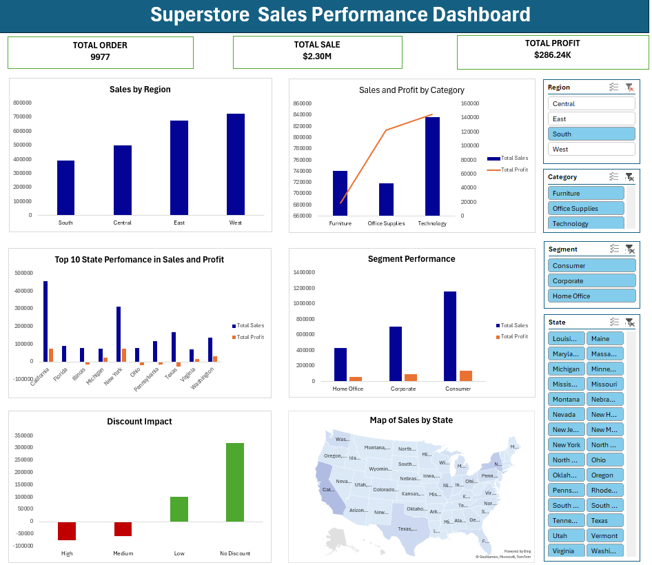
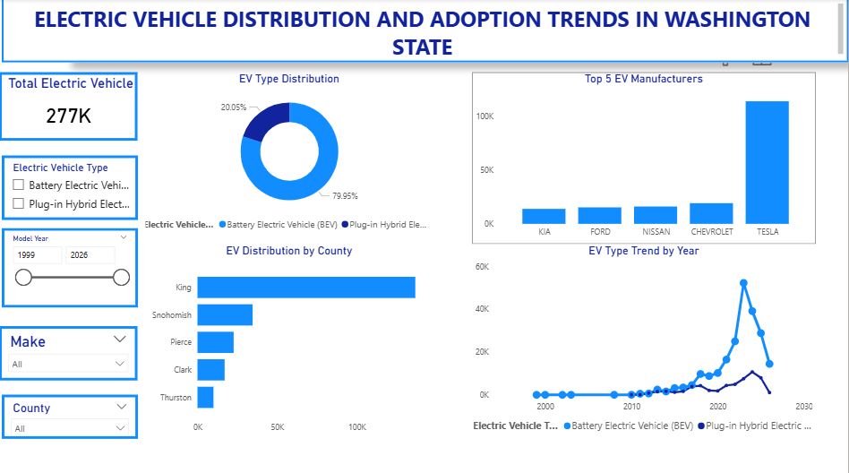

# Data Analytics Portfolio

# Project 1
**Title:** [Superstore Sales Performance Dashboard](https://github.com/Olatundebori/Oladimeji.github.io/blob/main/Sales%20Dashboard.xlsx) 

**Tools Used:** Microsoft Excel (Pivot Tables, Pivot Charts, Power Query Editor, Slicers, Conditional Formatting, VLOOKUP/XLOOKUP, Data Validation, Charts & Graphs, What-If Analysis)

**Project Description:** This project involved developing an interactive Superstore Sales Performance Dashboard using Microsoft Excel to analyse sales, profit, and customer segments across different regions and states. The dashboard integrates data cleaning, transformation, and visualisation techniques to provide a comprehensive view of business performance. It enables stakeholders to monitor key metrics, including total sales, profitability, regional performance, and discount impact, supporting strategic decision-making and operational efficiency.

**Key Findings:** Regional Performance:
The West ($725K) and East ($678K) regions generated the highest sales, indicating strong market presence.
The South region recorded the lowest sales, suggesting potential growth opportunities.
Category Insights:
Technology was the most profitable category, generating the highest sales ($836K) and profit ($145K).
Furniture had high sales but significantly low profit ($18K), indicating potential cost or pricing issues.
Customer Segment Analysis:
The Consumer segment contributed the largest share of sales ($1.16M) and profit ($134K).
Home Office generated the least revenue, highlighting a smaller market segment.
Discount Impact:
High and medium discounts resulted in significant losses (-$76K and -$58K), negatively affecting profitability.
No discount sales generated the highest profit ($320K), showing that excessive discounting reduces margins.
State-Level Performance:
California and New York were the top-performing states in both sales and profit.
Some states showed moderate sales but lower profitability, indicating inefficiencies or higher operational costs.

**Dashboard Overview:**

# Project 2
**Title:** SQL Data Definition & Manipulation-Sales Data and Workplace Safety Data

**SQL Code** [Sales Data and Workplace Safety Data](https://github.com/Olatundebori/Oladimeji.github.io/blob/main/Sales_Data.sql)

**SQL Skills Used** Database creation and table management (CREATE DATABASE, CREATE TABLE, ALTER TABLE, DROP TABLE)
Data insertion and batch inserts (INSERT INTO)
Data updating and deletion (UPDATE, DELETE)
Querying datasets with conditional logic (WHERE, IN, NOT IN, AND, OR)
Calculating derived metrics using SQL functions (DATEDIFF)
Data cleaning and transformation for reporting purposes
Working with Excel-imported datasets in SQL Server

**Project Description:** This project involved designing and managing SQL databases for sales records and workplace safety data. The tasks included creating and modifying tables, inserting multiple records, updating existing data, and querying datasets to extract insights. The project demonstrated practical knowledge in SQL Server, database structuring, and data manipulation. It also included working with imported Excel datasets to generate reports and support operational decision-making.

**Key Findings:** Sales Data:
Identified top-performing salespeople, regions, and product categories.
Calculated sales durations and tracked performance trends over time.
Updated and corrected regional data for accurate reporting.
Workplace Safety Data:
Highlighted plants and departments with the highest incident occurrences and costs.
Cleaned and filtered data to focus on actionable safety incidents.
Applied logical conditions to uncover patterns in injury locations and costs for targeted interventions.
Overall Insight:
Enabled data-driven decisions to improve sales performance and workplace safety efficiency.
Streamlined reporting processes, reducing manual effort and improving accuracy.

**Technology Used:** SQL Server

# Project 3

**Title:** SQL Data Definition & Manipulation – Employee Data Analysis

**SQL Code:** [Employee Data](https://github.com/Olatundebori/Oladimeji.github.io/blob/main/Employee_Analysis)

**SQL Skills Used:**

Selecting and renaming columns with aliases (AS)
String manipulation using LEFT(), CHARINDEX(), and concatenation
Conditional filtering with WHERE, IN, NOT IN, AND, OR
Aggregation and counting with COUNT()
Date and time functions (GETDATE())
Creating new tables from existing tables (SELECT INTO)
Fetching top N records (TOP(N))
Pattern matching with LIKE

**Project Description:** This project involved practising commonly asked SQL queries using an employee dataset to strengthen data analysis and problem-solving skills. Tasks included retrieving specific fields, filtering based on conditions, creating new tables, concatenating columns, and working with string and date functions. These exercises enhanced proficiency in querying, transforming, and interpreting data efficiently in SQL Server.

**Key Findings:**

Extracted employee first and last names, combined as full names for reporting purposes.
Retrieved employees based on department, salary range, and name patterns for targeted analysis.
Demonstrated string manipulation by extracting parts of addresses and creating new identifiers.
Practised date-based calculations and generated the current system date to support time-sensitive queries.
Created new tables and fetched top N records, simulating real-world data handling scenarios.

**Technology Used:** SQL Server

# Project 4
**Title:** [Electric Vehicle Distribution and Adoption Trends Dashboard](https://github.com/Olatundebori/Oladimeji.github.io/blob/main/EV%20Dashboard.pbix)

**Tools Used:** Power BI (Data modeling, DAX, interactive dashboards, slicers, data visualisation, timeline analysis, trend analysis, segmentation, KPI tracking, and geographic analysis)

**Project Description:** This project involved developing an interactive Power BI dashboard to analyze electric vehicle (EV) distribution and adoption trends in Washington State. The dashboard integrates data modelling and visualisation techniques to present key insights on EV growth, manufacturer dominance, regional distribution, and adoption patterns over time. It enables stakeholders to explore EV trends dynamically through filters such as vehicle type, model year, and location, supporting data-driven decisions in transportation planning and sustainability initiatives.

**Key Findings:** REV Adoption Growth:
EV adoption has increased significantly over recent years, with a sharp rise after 2020, indicating an accelerating transition toward sustainable transportation.
Vehicle Type Distribution:
Battery Electric Vehicles (BEVs) dominate the market (80%), showing stronger adoption compared to Plug-in Hybrid Electric Vehicles (PHEVs).
Manufacturer Insights:
Tesla leads significantly among EV manufacturers, outperforming competitors like Ford, Nissan, and Chevrolet.
Geographical Distribution:
King County has the highest concentration of EVs, followed by Snohomish and Pierce counties, highlighting urban dominance in EV adoption.
Trend Analysis:
EV registrations show consistent growth trends with noticeable peaks in recent years, reflecting increased awareness, policy support, and infrastructure development.

**Dashboard Overview:**

